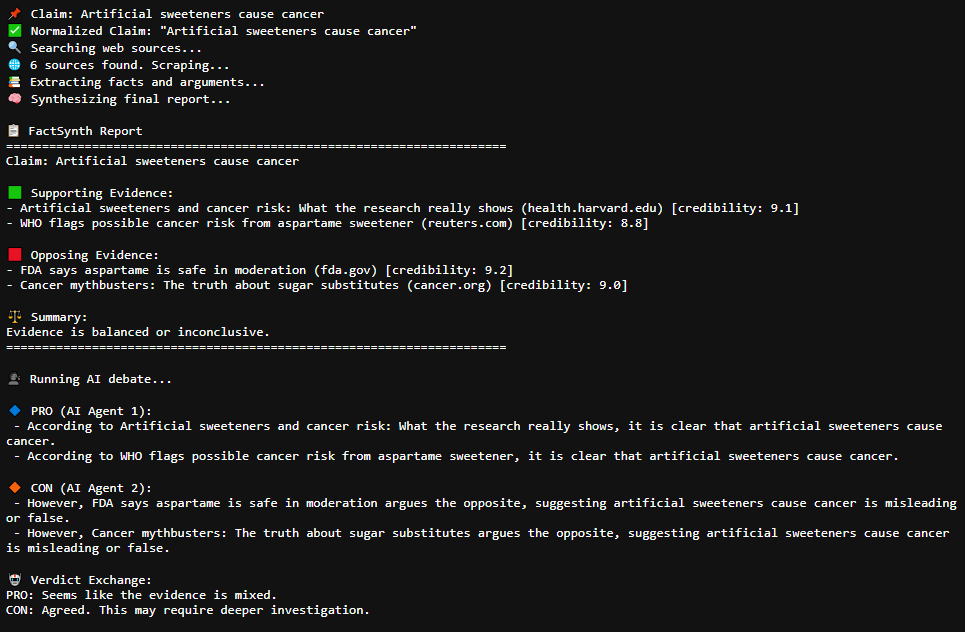

# 🧠 FactSynth — Autonomous AI Fact Checker & Debater

FactSynth is a fully autonomous research agent that:
- Analyzes a claim
- Scrapes real-time sources
- Extracts and scores arguments
- Evaluates credibility
- Produces a structured fact report
- (Optionally) simulates a mini AI debate

> “Artificial sweeteners cause cancer”  
✅ Let FactSynth investigate.

---



---

## 🚀 Features

- 🌐 **Live Web Search & Scraping** (Google + news/edu/org sites)
- 🧠 **NLP Extraction** (entities, sentiment, relevance)
- 📊 **Credibility Ranking** (domain authority, neutrality)
- 📋 **Fact vs. Fiction Summary** (with citations)
- 🤖 **Simulated AI Debate** (PRO vs CON logic agents)
- 🔌 **Modular Code** (ready for CLI or web dashboard)

---

## 🗂️ Project Structure
```bash
factsynth/
├── main.py # Entry point 
├── core/
│ ├── claim_handler.py # Cleans input
│ ├── search.py # Finds sources via Google
│ ├── scraper.py # Extracts article content
│ ├── extractor.py # NLP (spaCy + TextBlob)
│ ├── credibility.py # Ranks source quality
│ ├── synthesizer.py # Compiles fact report
│ └── debate.py # Optional: simulates AI argument
```
---

## 🧪 Sample Run

```bash
python main.py --claim "Artificial sweeteners cause cancer" --debate
- - - - - - - - - - - -
Output Highlights:

- 6 articles scraped

- 2 supporting, 2 opposing

Verdict: Inconclusive
- - - - - - - - - - - -
AI Debate:

- PRO cites WHO and Harvard

- CON references FDA and Cancer.org
```

## 🧰 Installation
```bash
pip install requests beautifulsoup4 spacy textblob
python -m spacy download en_core_web_sm
python -m textblob.download_corpora
```

## 📦 Future Ideas
- Streamlit dashboard for visual users
- Export fact reports to PDF/Markdown
- Add citation quality scores (e.g. citation count, date)
- LLM support for deeper synthesis and rebuttal logic
